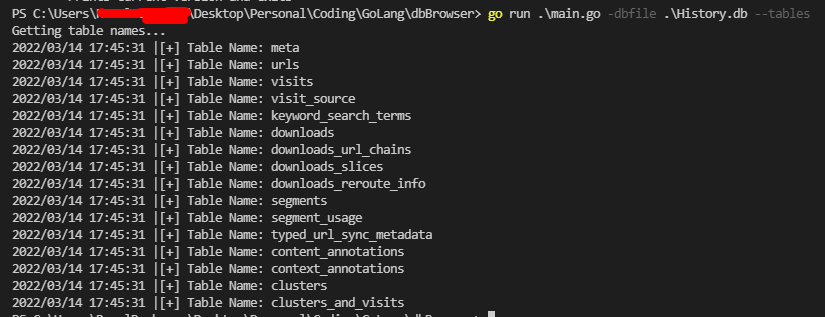
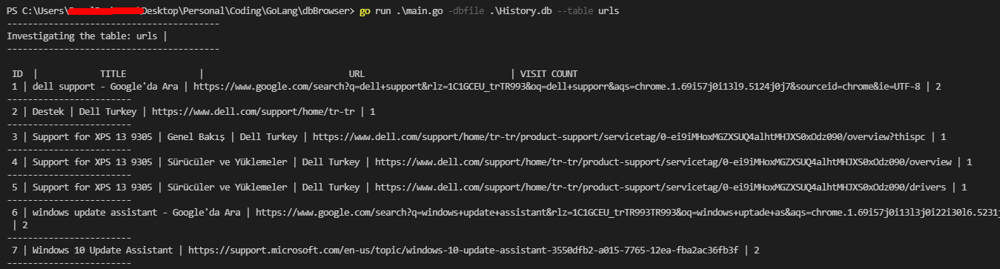

# dbBrowser-Go


## Run Locally

Clone the project

```bash
  PS C:\Users\...\GoLang\dbBrowser> go run .\main.go -h                               
Usage of C:\...\go-build3502846155\b001\exe\main.exe:
  -dbfile string
        Database file path to investigate
  -table string
        Table name to investigate        
  -tables
        Prints current version and exits 
```

### Show the list of tables
```bash
  go run .\main.go -dbfile .\History.db --tables
```


### Show the contents of urls table
```bash
  go run .\main.go -dbfile .\History.db --table urls
```


